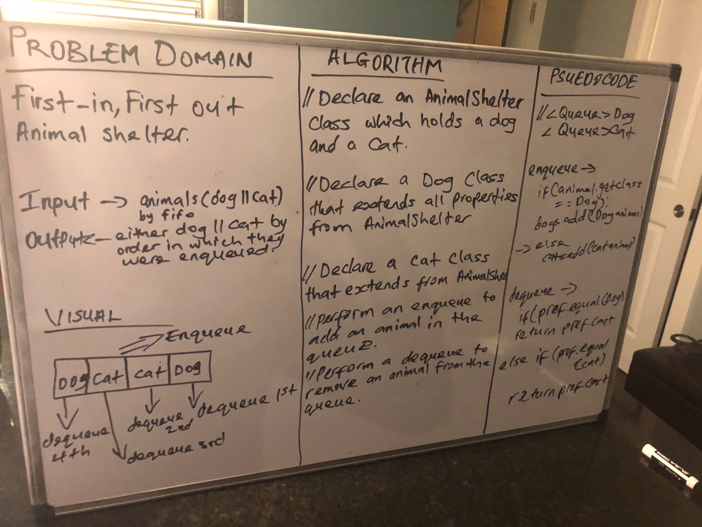

## Implement First-in, First out Animal Shelter.

## Challenge
- Create a class called AnimalShelter which holds only dogs and cats. The shelter operates using a first-in, first-out approach.
- enqueue(animal): adds animal to the shelter. animal can be either a dog or a cat object.
- dequeue(pref): returns either a dog or a cat. If pref is not "dog" or "cat" then return null.

## Approach and Efficiency
- I created an enqueue method that add either a dog or cat into the queue and a dequeue to remove the first animal in the queue.

## API
- enqueue(animal)
- dequeue(pref)

[My Code](https://github.com/jjblues86/data-structures-and-algorithms-/tree/master/datastructures/src/main/java/utilities)

