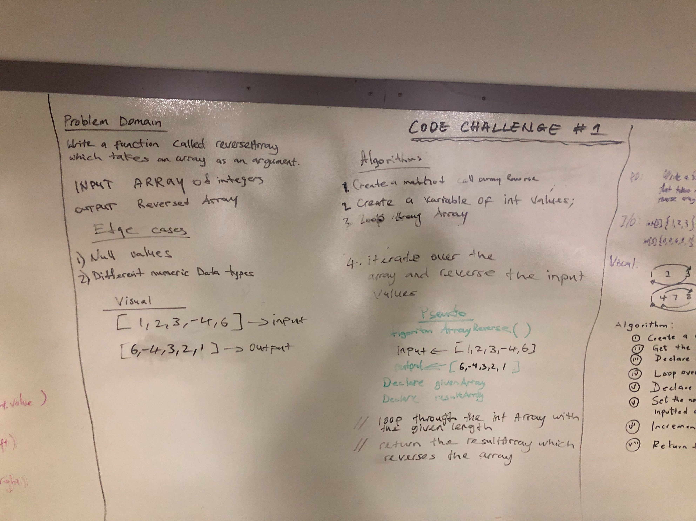

## Reverse an Array

## Challenge
- Write a function called reverseArray which takes an array as an argument. Without utilizing any of the built-in methods available to your language, return an array with elements in reversed order.

## Approach & Efficiency
- My partner and I during whiteboard pair programming we came up with the approach of creating a variable where we store the int array values. Later on loop through the the length of this array and return the reversed value of the initial array values. 

## Solution

