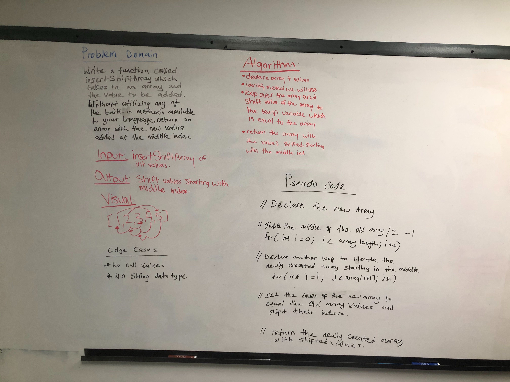

## Insert and shift an array in middle at index

## Challenge
- Write a function called insertShiftArray which takes in an array and the value to be added. Without utilizing any of the built-in methods available to your language, return an array with the new value added at the middle index.

## Approach & Efficiency
- I named a variable to create a new array which will hold the output of the new value including the values from the old array. I also took into consideration the length of the array since we are suppose to insert the new value in the middle of the array I divided the length of the old array by two, after this I loop through the array starting at the middle index which is a variable I created. Once the loop is complete I assign the old values from the old array into the new array.

## Solution
