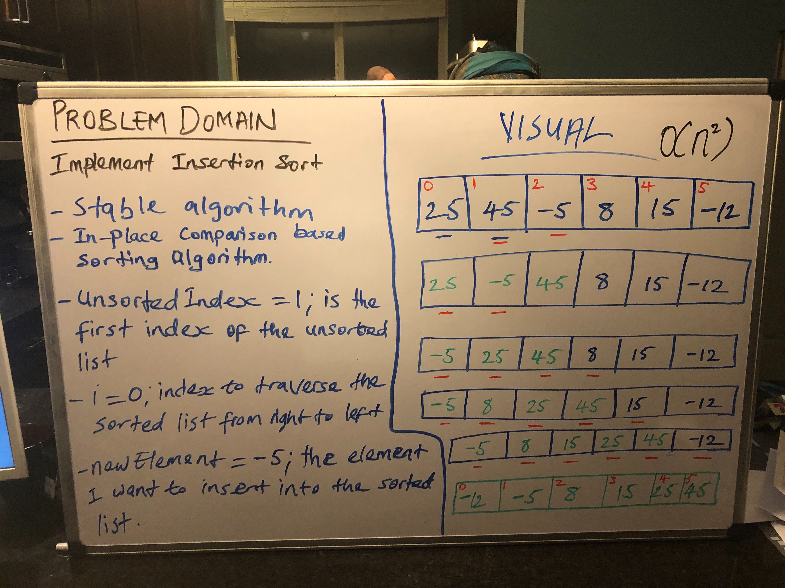

# Challenge Summary
Implement Insertion Sort
## Challenge Description
-Insertion sort is a stable algorithm and it is also considered an in-place sorting algorithm as well.

## Approach & Efficiency
- Determine the unsorted index in a given array as the first unsorted index and set i = 0 which is the index to traverse the sorted list from right to left. Initialize a new variable called newElement which is the element I want to insert into the sorted list.
- O(n^2) time complexity which is quadratic
## Solution

[My Code](https://github.com/jjblues86/data-structures-and-algorithms-/blob/master/datastructures/src/main/java/InsertionSort.java)

