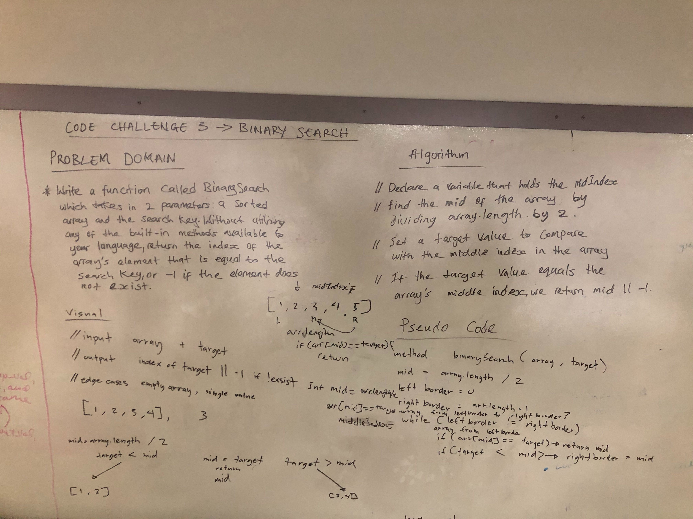

## Binary search in a sorted 1D array

## Challenge
- Write a function called BinarySearch which takes in 2 parameters: a sorted array and the search key. Without utilizing any of the built-in methods available to your language, return the index of the array’s element that is equal to the search key, or -1 if the element does not exist.

## Approach & Efficiency
- The data must be sorted and I should pick the element in the middle of the array and compare it against the search value.If the element is equal to the value, return the mid-point. If the element is greater than the value, search the left half of the array and If the element is less than the value, search the right half of the array.
- The Big O of this search algorithm is O(logn)

## Solution
