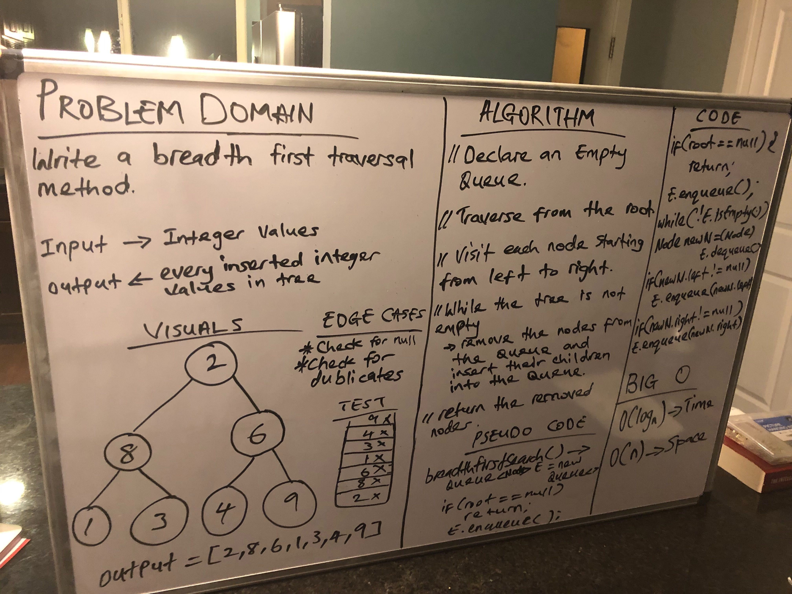

## Implementation Breadth-first Traversal

## Challenge
- Write a breadth first traversal method which takes a Binary Tree as its unique input. Without utilizing any of the built-in methods available to your language, traverse the input tree using a Breadth-first approach, and return a list of the values in the tree in the order they were encountered.

## Approach $ Efficiency
- I Implemented an empty Queue where I will push nodes from the tree into and remove the top node and add the next node in level from the tree. Once I go through each node in every level of the tree I have completed the whole process

## API

[Breadth-first Traversal](https://github.com/jjblues86/data-structures-and-algorithms-/blob/master/datastructures/src/main/java/tree/Tree.java)

