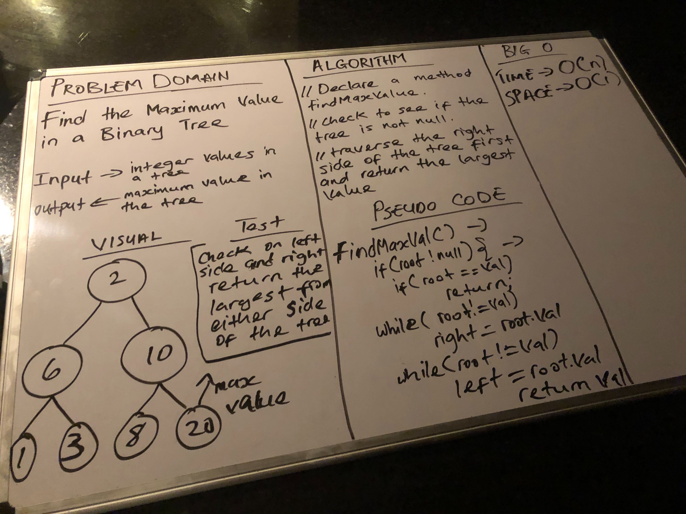

## Implementation Find the Maximum Value in a Binary Tree

## Challenge
- Write an instance method called find-maximum-value. Without utilizing any of the built-in methods available to your language, return the maximum value stored in the tree. You can assume that the values stored in the Binary Tree will be numeric.

## Approach $ Efficiency
- I check to make sure that the root of the tree is not null and then the traverse the left side ands right side of the tree to find the maximum value from the tree.

## API
- findMaxiMumValue()

[My Code](https://github.com/jjblues86/data-structures-and-algorithms-/blob/master/datastructures/src/main/java/tree/Tree.java)
