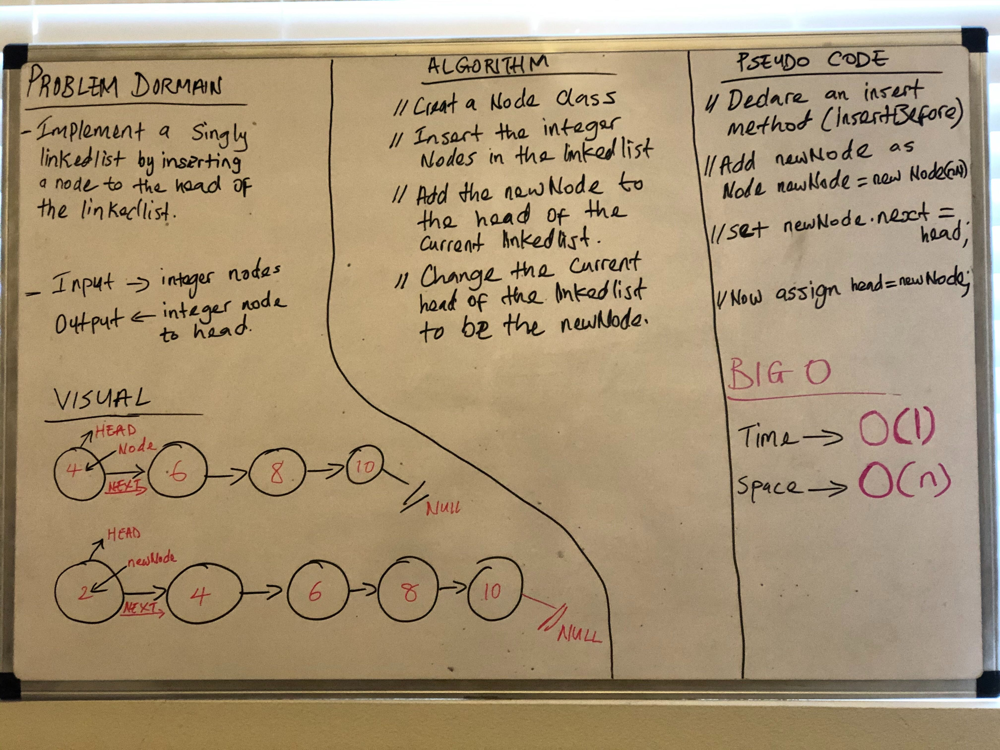

## Implementation: Singly Linked Lists

## Challenge
- Create a Node class that has properties for the value stored in the Node, and a pointer to the next Node.
- Within your LinkedList class, include a head property. Upon instantiation, an empty Linked List should be created.
- Define a method called insert which takes any value as an argument and adds a new node with that value to the head of the list with an O(1) Time performance.
- Define a method called includes which takes any value as an argument and returns a boolean result depending on whether that value exists as a Node’s value somewhere within the list.
- Define a method called toString (or __str__ in Python) which takes in no arguments and returns a string representing all the values in the Linked List, formatted as:
  "{ a } -> { b } -> { c } -> NULL"
  
  ## Approach & Efficiency
  [My Code](https://github.com/jjblues86/data-structures-and-algorithms-/blob/master/Data-Structures/src/main/java/Data/LinkedList/LinkedList.java)
  
  
  
  
  
  
  ## API
  - insert(newData) - this method allows user to enter any value into the linkelist.
  - includes(data) - this method checks to see if a value is available or included in the linkelist
  - toString() - this searches the linked list and should return the a string of all the values in the linked list
  - append(value) - this method adds a newNode to the end of the linkedlist
  - insertBefore(value, newVal) - this method should be adding a newNode before the targeted value in the linkelist
  - insertAfter(value, newVal) - this method will add a newNode after the atrgeted value in the linkedlist
  
  
  
  
  
