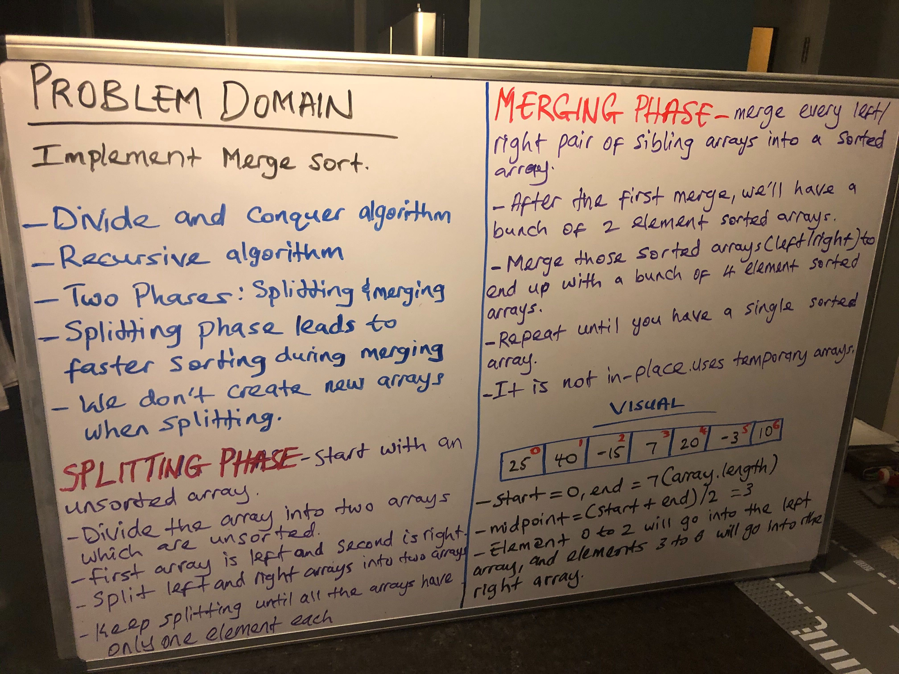

## Implementation of MergeSort

## Challenge Description
-Merge sort is a divide and conquer algorithm
- There are two phases involved: splitting and merging
- No new arrays are created
- Splitting phase leads to faster sorting during merging

## Approach & Efficiency
- Splitting phase: start with an unsorted array and divide the array into two arrays which are unsorted
- Merge every left and right pair of sibling arrays into a sorted array.
- O(logn2) base 2

## Solution
[My Code](https://github.com/jjblues86/data-structures-and-algorithms-/blob/master/datastructures/src/main/java/MergeSort.java)

