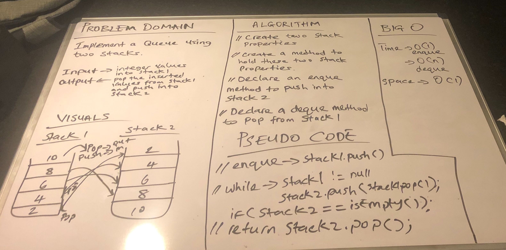

## Implement a Queue using two Stacks.

## Challenge
- enqueue(value) which inserts value into the PseudoQueue, using a first-in, first-out approach.
- dequeue() which extracts a value from the PseudoQueue, using a first-in, first-out approach.
- The Stack instances have only push, pop, and peek methods. You should use your own Stack implementation. Instantiate these Stack objects in your PseudoQueue constructor.

## Approach and Efficiency
- I created two stack properties which enables me to push(enqueue) items into one and pop(remove) items from it and also do the same operations into the second stack.

## API
- isEmpty() - checks to see if the queue is empty
- size() - checks for the length of the queues
- enqueue(int data) - adds items to the queue
- dequeue() - pops items from the queue

[My code](https://github.com/jjblues86/data-structures-and-algorithms-/blob/master/datastructures/src/main/java/stacksandqueues/PseudoQueue.java)

