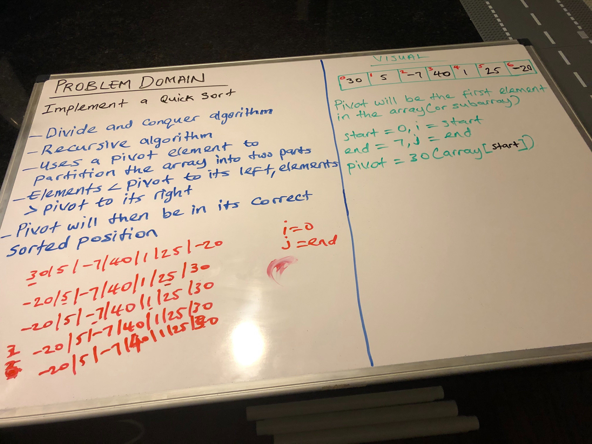

## Implementation of QuickSort

## Challenge Description
- Quick Sort is a divided and conquer algorithm
- Recursive algorithm

## Approach & Efficiency
- Uses a pivot element to partition the array into two parts
- Elements < pivot to its left, elements > pivot to its right
- Pivot will then be in its correct sorted position
- O(nlogn)

## Solution
[My Code](https://github.com/jjblues86/data-structures-and-algorithms-/blob/master/datastructures/src/main/java/QuickSort.java)

