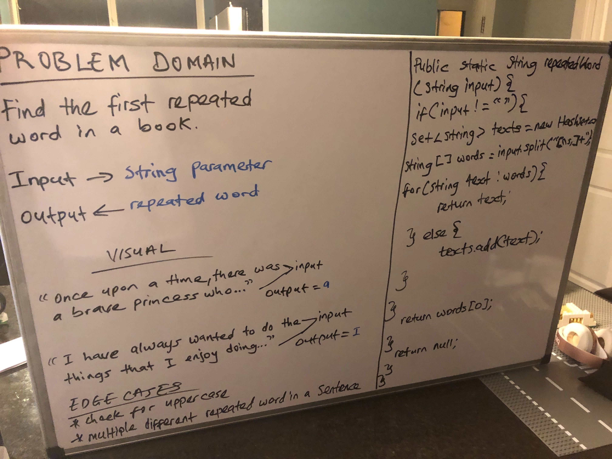

## Repeated Word

## Challenge Description
- Find the first repeated word in a book
- Write a function that accepts a lengthy string parameter.
- Without utilizing any of the built-in library methods available to your language, return the first word to occur more than once in that provided string.

## Approach & Efficiency
- Create a function to check if the given string parameter has repeated words. Loop through the string to check for this condition and if a word is repeated, return that word.

[My Code](https://github.com/jjblues86/data-structures-and-algorithms-/blob/master/datastructures/src/main/java/repeatedWord/RepeatedWord.java)

