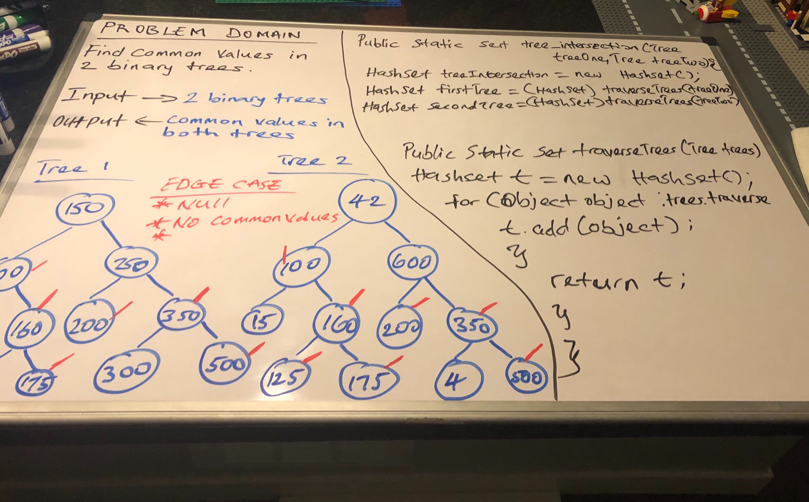

## Find common values in 2 binary trees.

## Challenge Description
- Write a function called tree_intersection that takes two binary tree parameters.
- Without utilizing any of the built-in library methods available to your language, return a set of values found in both trees.

[My Code](https://github.com/jjblues86/data-structures-and-algorithms-/blob/master/datastructures/src/main/java/TreeIntersection/TreeIntersection.java)

