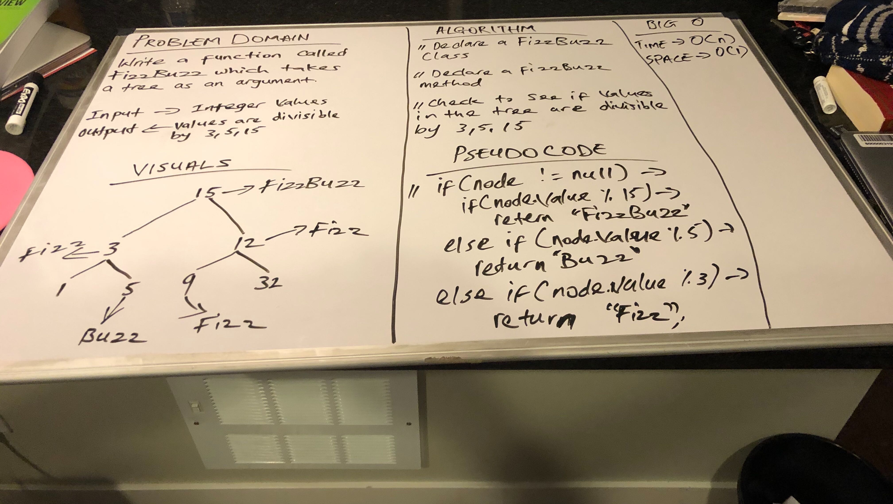

## Implementation FizzBuzz Tree

## Challenge
- Write a function called FizzBuzzTree which takes a tree as an argument.
- Without utilizing any of the built-in methods available to your language, determine whether or not the value of each node is divisible by 3, 5 or both. Create a new tree with the same structure as the original, but the values modified as follows:
- If the value is divisible by 3, replace the value with “Fizz”
- If the value is divisible by 5, replace the value with “Buzz”
- If the value is divisible by 3 and 5, replace the value with “FizzBuzz”
- If the value is not divisible by 3 or 5, simply turn the number into a String.
- Return the new tree.

## Approach and Efficiency
- Implemented a fizzBuzz method to handle the functionality of dividing the values in the tree that are divisible by 3,5,15. I check to see if the root of the tree is not null and compare the new node value to see which side of the tree to add it to either left or right. The Big O of this is O(n) -> time and O(1) -> space

[fizzBuzzTree](https://github.com/jjblues86/data-structures-and-algorithms-/blob/master/datastructures/src/main/java/tree/FizzBuzzTree.java)

